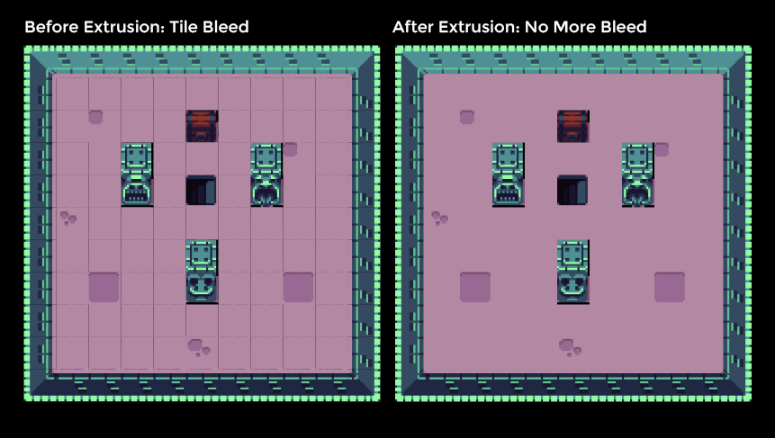

# Tile Extruder

A tiny Node app to extrude tiles in tilesets to avoid bleeding issues.




You can read more about the bleeding problem and solution [here](http://rotorz.com/unity/tile-system/docs/edge-correction).

## Installation

Make sure you have [node](https://nodejs.org/en/) installed. [Download](https://github.com/sporadic-labs/tile-extruder/archive/master.zip) or [clone](x-github-client://openRepo/https://github.com/sporadic-labs/tile-extruder) the repository, open a terminal in the folder and run:

```
npm install
```

## Usage

Open a terminal in the folder and run a command with the following arguments:

```
node ./index.js --tileWidth <integer> --tileHeight <integer> --input <path> --output <path>
```

An example usage:

```
node ./index.js --tileWidth 25 --tileHeight 25 --input ./tilesets/buch-tileset.png --output ./tilesets/buch-tileset-extruded.png
```

Additional usage information:

```
A small CLI to extrude tiles. Use --help for more information.

Options:

  -V, --version               output the version number
  -w, --tileWidth <integer>   tile width in pixels
  -h, --tileHeight <integer>  tile height in pixels
  -i, --input <path>          the path to the tileset you want to extrude
  -o, --output <path>         the path to output the extruded tileset image
  -h, --help                  output usage information
```

## Tileset Sources

* Dungeon Tileset by Buch - [Source](https://opengameart.org/content/top-down-dungeon-tileset)
* Minirouge Tileset by Arachne - [Source](https://forums.tigsource.com/index.php?topic=14166.0)
* Mario Tileset - [Source](http://rmrk.net/index.php?topic=37002.0)
